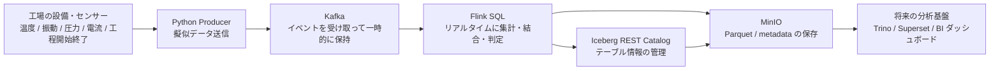

# Kafka + Flink + Iceberg Factory Streaming Lab

Kafka、Flink、MinIO、Iceberg REST Catalog をローカル Docker 上で動かし、
工場設備を模したリアルタイム処理を学ぶためのリポジトリです。

この README は、Apache Kafka / Flink / Iceberg を初めて触る人だけでなく、
IT の専門知識が深くない人でも、
「なぜこういう仕組みが必要なのか」
「工場で何ができるようになるのか」
「このリポジトリでどこまで試せるのか」
を追えることを目標にしています。

## システム構成図



## このシステムが必要な背景

工場では、設備が止まったあとに原因を調べるだけでは遅いことがあります。
品質不良、微妙な温度上昇、振動の増加、停止理由の偏りは、
現場では少しずつ起きていても、表計算の手集計では見落としやすいです。

そこで、設備やセンサーから出る情報をリアルタイムに集め、
その場で整理し、あとから分析しやすい形でためる仕組みが必要になります。

このリポジトリは、その縮小版です。

- センサー値が流れ続ける
- 工程の開始と終了イベントが流れる
- それらを時刻で結び付ける
- 製品単位の summary を作る
- 将来は BI で見られる形にする

という一連の流れを、ローカル PC 上で再現できます。

## 今回のシチュエーション

このリポジトリでは、次のような工場を想定しています。

- 1つの製品が `process_1` と `process_2` を順番に通る
- 工程 1 では `sensor-a` が温度と振動を送る
- 工程 2 では `sensor-b` が圧力と電流を送る
- さらに `process-events` が、各製品の工程開始と工程終了を送る

これによって、単なる「時系列のセンサー値」ではなく、
「どの製品が、どの工程にいた時に、どんな状態だったか」を追えるようになります。

## 実際の工場で同じ考え方を使うと何ができるか

- ライン停止の兆候を早く見つける
  - 温度上昇や振動増加を、停止前のパターンとして見つけやすくなります
- 品質不良と設備状態の関係を見る
  - 不良が多い製品群で、圧力や電流の傾向が違うかを分析できます
- 工程ごとの滞留時間や処理時間を追う
  - どこで時間がかかっているかを製品単位で見られます
- 停止理由とセンサー異常を結び付ける
  - 人が入力した停止理由と実際の設備状態を同時に扱えます
- BI ダッシュボードにつなげる
  - 現場の稼働状況、異常件数、平均温度、工程時間などを可視化できます

## このリポジトリで学べること

- イベントデータを Kafka で受ける考え方
- Flink SQL でリアルタイムに join と集計をする方法
- Iceberg で結果をテーブルとして残す考え方
- MinIO を S3 互換ストレージとして使う方法
- 将来 Trino や Superset につなげるための土台の作り方

## これは何をするリポジトリか

- Python producer が擬似工場データを Kafka topic に送る
- Flink SQL が Kafka からイベントを読み、工程ごとの明細や製品単位 summary を作る
- Iceberg を使うと、その結果をテーブルとして永続保存できる
- MinIO は Iceberg の実ファイル保存先として使う
- Iceberg REST Catalog は、Iceberg テーブルの metadata を管理する
- 将来的には Trino や Superset から BI 用に参照できる構成へ広げやすい

## 重要な用語

IT に詳しくない人向けに、まずは「それぞれが何の担当か」で理解すると分かりやすいです。

- Apache Kafka
  - 何をするものか
    - 工場から流れてくるイベントを受け取り、順番を保ちながらためておく仕組みです
    - たとえると、現場から届く情報をいったん受け止める「高速な受付窓口」です
  - このリポジトリでの役割
    - `sensor-a` `sensor-b` `process-events` の 3 topic を受け持ちます
  - 誰が開発しているか
    - 現在は Apache Software Foundation のオープンソースプロジェクトです
    - もともとは LinkedIn で Jay Kreps、Jun Rao、Neha Narkhede らが作り始めました

- Apache Flink
  - 何をするものか
    - 流れてきたデータを止めずに、その場で計算する仕組みです
    - たとえると、受付に届いた情報をリアルタイムで見て判断する「現場の分析係」です
  - このリポジトリでの役割
    - Kafka のイベントを読み、工程区間を作り、センサーデータを結合し、summary を作ります
  - 誰が開発しているか
    - 現在は Apache Software Foundation のオープンソースプロジェクトです
    - もともとは Stratosphere という研究プロジェクトとして始まり、その後 Apache Flink になりました

- Apache Iceberg
  - 何をするものか
    - 加工したデータを、あとで SQL で安全に読みやすい「テーブル」として保存する仕組みです
    - 単なるファイル置き場ではなく、更新履歴や schema 変更も扱いやすくします
  - このリポジトリでの役割
    - Flink が作った結果を、分析しやすいテーブルとして保存するために使います
  - 誰が開発しているか
    - 現在は Apache Software Foundation のオープンソースプロジェクトです

- MinIO
  - 何をするものか
    - 大きなデータファイルを保存するためのオブジェクトストレージです
    - AWS S3 と似た使い方ができるので、ローカル学習環境でよく使われます
  - このリポジトリでの役割
    - Iceberg の Parquet や metadata JSON の保存先です
  - 誰が開発しているか
    - MinIO 社が開発しているオープンソース製品です
    - 2014 年に Garima Kapoor、Anand Babu "AB" Periasamy、Harshavardhana らが創業しました

- Catalog
  - 何をするものか
    - Iceberg テーブルの台帳です
    - 「どのテーブルが、どの metadata を使っているか」を管理します
  - たとえ
    - MinIO が倉庫なら、Catalog は倉庫の在庫台帳です

- Iceberg REST Catalog
  - 何をするものか
    - Catalog を HTTP API として公開したものです
  - このリポジトリでの役割
    - Flink や将来の Trino が、同じ Iceberg テーブルを共通認識で扱えるようにします

- ZooKeeper
  - 何をするものか
    - 分散システムの設定や状態をそろえるための仕組みです
  - このリポジトリでの役割
    - いまの Kafka 構成では、Kafka の補助コンポーネントとして使っています
  - 補足
    - 新しい Kafka では ZooKeeper を使わない構成も増えていますが、この学習環境では従来構成を使っています

## 全体構成

もう少し正確に書くと、役割はこう分かれます。

- Python -> Kafka
  - 擬似センサーデータを送る
- Flink -> Kafka
  - データを読む
- Flink -> Iceberg REST Catalog
  - テーブル定義や snapshot 情報を問い合わせる
- Flink -> MinIO
  - 実際の Parquet / metadata file を書く
- Trino / Superset
  - このリポジトリには未導入だが、将来ここに接続して分析・可視化する想定

## 現在の実装範囲

- Kafka / Zookeeper は Docker Compose で起動する
- Flink JobManager / TaskManager は Docker Compose で起動する
- MinIO と Iceberg REST Catalog も Docker Compose で起動する
- `job.sql` と `job_summary.sql` は現在 `print` sink へ出力する
- Iceberg への最小疎通確認は、Flink SQL Client から手動で行う

重要:

- `job.sql` と `job_summary.sql` は、まだ Iceberg へ保存するようにはしていません
- まずは `sample_events` のような小さなテーブルで Iceberg 疎通を確認し、その後に本番用 SQL を広げる想定です

## ディレクトリ構成

- `python-producer/send_factory_data.py`
  - 工場設備を模した擬似データを Kafka に送る producer
- `kafka-test/docker-compose.yml`
  - Kafka / Zookeeper の compose
- `flink-test/docker-compose.yml`
  - Flink / MinIO / Iceberg REST Catalog の compose
- `flink-test/Dockerfile`
  - Kafka connector、Iceberg、Hadoop client JAR を含んだ Flink イメージ
- `flink-test/job.sql`
  - 工程区間とセンサーイベントを join して明細を作る SQL
- `flink-test/job_summary.sql`
  - 製品シリアル単位の summary を作る SQL
- `start_all.sh`
  - Kafka / Flink / MinIO / Iceberg REST を起動し、bucket と topic を確認する
- `stop_all.sh`
  - Kafka / Flink / MinIO / Iceberg REST を停止する
- `create_topics.sh`
  - 学習用 Kafka topic を作成する
- `watch_topics.sh`
  - Kafka topic を監視する

## 前提条件

- Docker Desktop が起動していること
- `docker compose` が使えること
- `python3` が使えること
- 次のポートが空いていること
  - `2181` Zookeeper
  - `29092` Kafka
  - `8081` Flink UI
  - `8181` Iceberg REST Catalog
  - `9000` MinIO API
  - `9001` MinIO Console

## Python セットアップ

producer を実行する前に依存を入れます。

```bash
cd /Users/makoto/docker-lab
python3 -m venv .venv
source .venv/bin/activate
python3 -m pip install --upgrade pip
python3 -m pip install -r requirements.txt
```

## 一番重要な起動と停止

### 起動

```bash
cd /Users/makoto/docker-lab
./start_all.sh
```

`start_all.sh` は次を行います。

- Docker daemon が使えるまで待つ
- `stream-shared` network がなければ作る
- Kafka stack を起動する
- Flink / MinIO / Iceberg REST stack を起動する
- `warehouse` bucket が存在するか確認する
- Kafka topic を作成する

起動後に確認できる URL:

- Flink UI: `http://localhost:8081`
- MinIO Console: `http://localhost:9001`
- Iceberg REST Catalog: `http://localhost:8181`

### 停止

```bash
cd /Users/makoto/docker-lab
./stop_all.sh
```

`stop_all.sh` はコンテナを停止しますが、次のデータは残ります。

- `flink-test/minio-data`
  - MinIO の保存データ
- `flink-test/iceberg-rest-data`
  - Iceberg REST Catalog の metadata SQLite

つまり、`stop_all.sh` のあとに `start_all.sh` で再開しても、
MinIO 上のファイルと Iceberg Catalog の metadata は引き継がれます。

注意:

- Flink SQL Client で実行した `CREATE CATALOG lakehouse ...` はセッション定義です
- Iceberg の table metadata 自体は保存されますが、Flink SQL Client を開き直したら `CREATE CATALOG` は再度実行してください

## クイックスタート

最短で流れをつかむなら、次の順番です。

1. 依存を入れる

```bash
cd /Users/makoto/docker-lab
source .venv/bin/activate
```

2. 基盤を起動する

```bash
./start_all.sh
```

3. producer を流す

```bash
python3 python-producer/send_factory_data.py
```

4. 別ターミナルで Flink の既存 SQL を試す

```bash
./flink-test/apply_job.sh ./flink-test/job.sql
```

summary を見たい場合:

```bash
./flink-test/apply_job.sh ./flink-test/job_summary.sql
```

5. Iceberg 疎通を試す
   - 下の「Iceberg の最小確認」を実行する

## Kafka topic

- `sensor-a`
  - 工程 1 側センサー
  - 温度 `value_temp`、振動 `value_vibration` を送る
- `sensor-b`
  - 工程 2 側センサー
  - 圧力 `pressure`、電流 `current` を送る
- `process-events`
  - 製品シリアル単位の工程開始 / 終了イベント
  - `process_1` と `process_2` の start/end を送る

## サンプルデータ

このリポジトリでは、3つの topic に次のような JSON が流れます。

### `sensor-a`

工程 1 側のセンサー値です。

```json
{
  "sensor_id": "A",
  "event_time_str": "2026-03-22T10:00:01.123456",
  "value_temp": 31.2,
  "value_vibration": 0.42,
  "unit": "machine-01",
  "status": "RUNNING"
}
```

意味:

- `value_temp`
  - 温度
- `value_vibration`
  - 振動
- `unit`
  - どの設備で出た値か
- `status`
  - 稼働状態

### `sensor-b`

工程 2 側のセンサー値です。

```json
{
  "sensor_code": "B-01",
  "ts_str": "2026-03-22T10:00:02.456789",
  "pressure": 102.4,
  "current": 8.7,
  "line": "machine-01",
  "status": "RUNNING"
}
```

意味:

- `pressure`
  - 圧力
- `current`
  - 電流
- `line`
  - どの設備で出た値か
- `status`
  - 稼働状態

### `process-events`

製品単位の工程開始 / 工程終了イベントです。

```json
{
  "serial_no": "SN00000123",
  "process": "process_1",
  "event_type": "start",
  "event_time_str": "2026-03-22T10:00:00.000000",
  "equipment_id": "machine-01",
  "reason": null
}
```

意味:

- `serial_no`
  - 製品シリアル番号
- `process`
  - どの工程か
- `event_type`
  - `start` または `end`
- `equipment_id`
  - どの設備で処理したか
- `reason`
  - 停止や乱れが含まれた場合の補助情報

## Flink でどう結合されるか

`sensor-a` と `sensor-b` は、製品シリアル番号を直接持っていません。
そのため、Flink はまず `process-events` を基準にして、
「どの製品が、いつからいつまで、その設備で処理されていたか」という工程区間を作ります。

流れはこうです。

1. `process-events` から `start` と `end` を集めて工程区間を作る
2. `process_1` の区間には `sensor-a` を結び付ける
3. `process_2` の区間には `sensor-b` を結び付ける
4. 時刻がその区間の中に入っているセンサー値だけを採用する
5. それを製品単位の明細や summary にまとめる

イメージ:

```text
process-events:
  SN00000123 / process_1 / start 10:00:00
  SN00000123 / process_1 / end   10:00:10

sensor-a:
  machine-01 / 10:00:01 / temp=31.2
  machine-01 / 10:00:05 / temp=31.5
  machine-01 / 10:00:11 / temp=31.8

Flink が結び付ける結果:
  10:00:01 と 10:00:05 は process_1 の区間内なので採用
  10:00:11 は区間外なので採用しない
```

この仕組みによって、
「ただの時系列センサーデータ」だったものを、
「ある製品が工程を通っていた間の設備状態」に変換できます。

## このシミュレーターが再現する現実

このリポジトリの producer は、理想状態だけでなく、
現実の工場で起きるような乱れも段階的に再現できます。

`python-producer/send_factory_data.py` には難易度設定があり、
`CURRENT_DIFFICULTY` を切り替えるだけでシナリオを変えられます。

用意している段階:

- `IDEAL`
  - 停止なし、欠損なし、遅延なしの理想状態
- `BASIC_DISTURBANCE`
  - 軽い停止、軽いドロップ、軽い遅延
- `REALISTIC`
  - 現実的な停止、欠損、ノイズ、送信遅延
- `HARSH`
  - 乱れがかなり大きい厳しい状態

設定によって変わるもの:

- 設備停止の発生確率
- 停止時間の長さ
- センサーイベントの欠損率
- センサー値のノイズ量
- 送信遅延の大きさ

つまり、このシミュレーターは
「理想的に動く工場」から
「停止や欠損やノイズがある現実的な工場」までを切り替えて試せます。

これにより、
正常時の処理だけでなく、
異常や乱れが混ざったときに summary や disturbance 判定がどう変わるかも学べます。

## まず動作確認したい人向けの重要コマンド

### コンテナ一覧

```bash
docker ps
```

### Kafka topic 一覧

```bash
./watch_topics.sh all
```

### Kafka topic の中身を見る

```bash
./watch_topics.sh process-events
./watch_topics.sh sensor-a
./watch_topics.sh sensor-b
./watch_topics.sh process-events --from-beginning
```

### Flink の実行中ジョブを見る

```bash
docker exec -it flink-jobmanager ./bin/flink list
```

### Flink ジョブを止める

```bash
docker exec -it flink-jobmanager ./bin/flink cancel <JOB_ID>
```

### Flink TaskManager ログを見る

```bash
docker logs -f flink-taskmanager
```

### Iceberg REST Catalog ログを見る

```bash
docker logs -f iceberg-rest
```

### MinIO 上の bucket を見る

```bash
docker exec mc /usr/bin/mc ls local
```

### MinIO 上の Iceberg ファイルを辿る

```bash
docker exec mc /usr/bin/mc find local/warehouse
```

## Iceberg の最小確認

この手順では、既存ジョブを変更せずに、
Flink から Iceberg に 1 テーブル書けることだけを確認します。

### 1. Flink SQL Client に入る

```bash
docker exec -it flink-jobmanager ./bin/sql-client.sh
```

### 2. Iceberg REST Catalog を登録する

Flink SQL Client の中で実行します。

```sql
CREATE CATALOG lakehouse WITH (
  'type' = 'iceberg',
  'catalog-type' = 'rest',
  'uri' = 'http://iceberg-rest:8181',
  'warehouse' = 's3://warehouse/',
  'io-impl' = 'org.apache.iceberg.aws.s3.S3FileIO',
  's3.endpoint' = 'http://minio:9000',
  's3.access-key-id' = 'minioadmin',
  's3.secret-access-key' = 'minioadmin',
  's3.path-style-access' = 'true'
);
```

### 3. catalog と database を使う

```sql
USE CATALOG lakehouse;
CREATE DATABASE IF NOT EXISTS lab;
USE lab;
SHOW TABLES;
```

### 4. テスト用テーブルを作る

```sql
CREATE TABLE sample_events (
  id BIGINT,
  name STRING,
  created_at TIMESTAMP(3)
) WITH (
  'format-version' = '2',
  'write.format.default' = 'parquet'
);
```

### 5. データを書いて読み返す

```sql
INSERT INTO sample_events VALUES
  (1, 'first', CURRENT_TIMESTAMP);

SELECT * FROM sample_events;
```

### 6. MinIO 側でファイルを確認する

別ターミナルで実行します。

```bash
docker exec mc /usr/bin/mc find local/warehouse
```

ここで `metadata` や `data` 配下のファイルが見えれば、
`Flink -> Iceberg REST Catalog -> MinIO` の経路が動いています。

## 既存 SQL ジョブの意味

### `flink-test/job.sql`

- `process-events` から工程区間を作る
- `sensor-a` を `process_1` 区間に join する
- `sensor-b` を `process_2` 区間に join する
- 明細イベントを `print` sink に出す
- まずはイベントの紐付けが正しいか確認するための SQL

### `flink-test/job_summary.sql`

- 工程区間を基に製品シリアル単位の summary を作る
- センサーイベントが 0 件でも製品行自体は残す
- `cnt_sensor_a` / `cnt_sensor_b` で欠損状況を判断できる
- disturbance は停止理由とセンサーステータスから算出する
- 現在は `print` sink に出す

## Iceberg に既存 summary を保存したいときの考え方

今の `job_summary.sql` は最終的に `product_summary_print` へ出力しています。
Iceberg に保存したいときは、最後の sink を Iceberg table に置き換えます。

考え方は次のとおりです。

1. 既存の view `product_summary` はそのまま使う
2. Iceberg table を別名で作る
3. `INSERT INTO iceberg_table SELECT ... FROM product_summary` に変える

例:

```sql
CREATE TABLE product_summary_iceberg (
  serial_no STRING,
  equipment_id STRING,
  process_1_start TIMESTAMP(3),
  process_1_end TIMESTAMP(3),
  process_1_duration_sec BIGINT,
  avg_temp_a DOUBLE,
  max_temp_a DOUBLE,
  avg_vibration_a DOUBLE,
  cnt_sensor_a BIGINT,
  process_2_start TIMESTAMP(3),
  process_2_end TIMESTAMP(3),
  process_2_duration_sec BIGINT,
  avg_pressure_b DOUBLE,
  max_pressure_b DOUBLE,
  avg_current_b DOUBLE,
  cnt_sensor_b BIGINT,
  has_disturbance BOOLEAN
) WITH (
  'format-version' = '2',
  'write.format.default' = 'parquet'
);

INSERT INTO product_summary_iceberg
SELECT
  serial_no,
  equipment_id,
  process_1_start,
  process_1_end,
  process_1_duration_sec,
  avg_temp_a,
  max_temp_a,
  avg_vibration_a,
  cnt_sensor_a,
  process_2_start,
  process_2_end,
  process_2_duration_sec,
  avg_pressure_b,
  max_pressure_b,
  avg_current_b,
  cnt_sensor_b,
  has_disturbance
FROM product_summary;
```

## 典型的な作業フロー

### 1. 基盤だけ起動して疎通を見る

```bash
./start_all.sh
docker ps
docker exec mc /usr/bin/mc ls local
```

### 2. producer を流して Kafka を見る

```bash
python3 python-producer/send_factory_data.py
./watch_topics.sh process-events
```

### 3. Flink SQL を実行してログを見る

```bash
./flink-test/apply_job.sh ./flink-test/job.sql
docker logs -f flink-taskmanager
```

### 4. Iceberg のテストテーブルを作る

```bash
docker exec -it flink-jobmanager ./bin/sql-client.sh
```

その後、上の `CREATE CATALOG` と `CREATE TABLE sample_events` を実行します。

## よくあるトラブル

### `ModuleNotFoundError: No module named 'kafka'`

- 仮想環境が有効か確認する
- `python3 -m pip install -r requirements.txt` を再実行する

### `Cannot connect to the Docker daemon`

- Docker Desktop が起動しているか確認する
- `docker ps` が成功する状態で再実行する

### `network stream-shared declared as external, but could not be found`

- 通常は `start_all.sh` が自動作成する
- 手動で作るなら次を実行する

```bash
docker network create stream-shared
```

### Flink SQL で `org.apache.hadoop.conf.Configuration` が見つからない

- Flink イメージに Hadoop client JAR が入っていない
- `flink-test/Dockerfile` に Hadoop client の `COPY` があるか確認する
- 必要なら再 build する

```bash
cd /Users/makoto/docker-lab/flink-test
docker compose build --no-cache
docker compose up -d
```

### Iceberg 作成時に `UnknownHostException: warehouse.minio` が出る

- REST catalog 側の path-style 設定が効いていない
- `flink-test/docker-compose.yml` の `iceberg-rest` に
  `CATALOG_S3_PATH__STYLE__ACCESS=true` があるか確認する
- 変更後は `iceberg-rest` を再作成する

```bash
cd /Users/makoto/docker-lab/flink-test
docker compose up -d --force-recreate iceberg-rest
```

### `warehouse` bucket が見つからない

- `mc` コンテナが起動しているか確認する
- `docker exec mc /usr/bin/mc ls local` を実行する
- 通常は `start_all.sh` が bucket 存在確認まで行う

### summary に値が出ない、または一部列が `NULL`

- producer が動いているか確認する
- `process-events` に start/end が両方出ているか確認する
- summary は completed interval を基準に作るため、工程終了前は未確定になる
- センサーが欠損した場合でも行は残るが、平均値列は `NULL`、件数列は `0` になる

### `current` が SQL 予約語と衝突する

- `sensor-b` の電流列は SQL 内で `` `current` `` として参照している

## 補足

- `start_all.sh` は毎回 `create_topics.sh` も実行する
- 既存の Flink ジョブは自動停止しない
- ジョブを切り替えるときは `flink list` で job id を見て明示的に cancel する
- MinIO の認証情報 `minioadmin / minioadmin` は学習用の固定値であり、ローカル用途前提
- 将来 Superset までつなぐときは、Trino を追加して Superset から Trino 経由で Iceberg table を読む構成が自然
